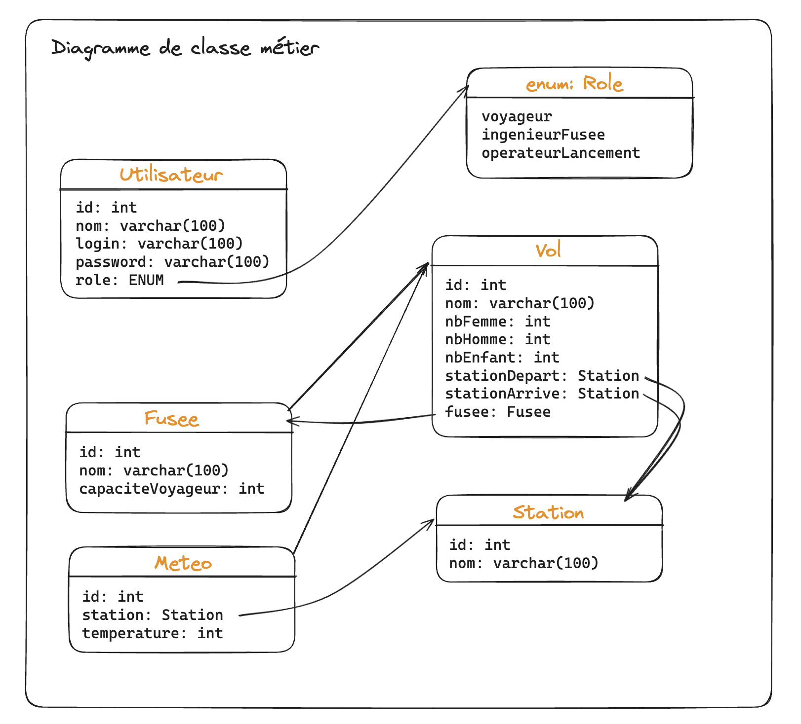
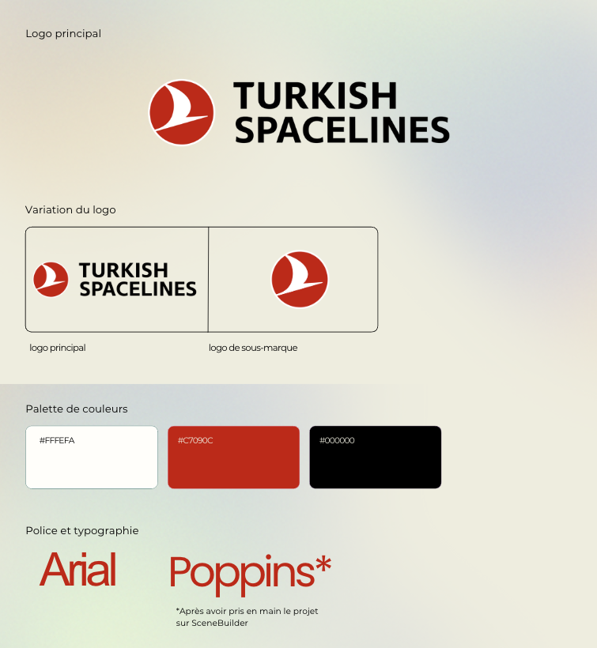
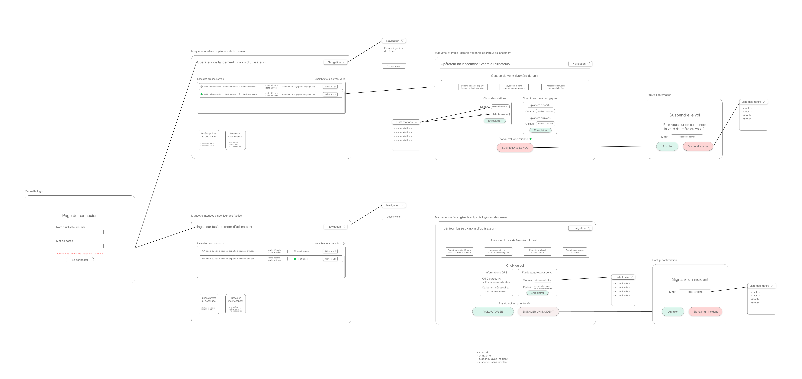

# Projet TurkishSpacelines avec JavaFX

[Fatih CAKICI](/B1_Systeme/img/mailto:fatih.cakici@edu.esiee-it.fr), ESIEE-IT
Projet MyEasyline (BTS - SIO) - 19/12/2023

# Cahier des charges

### Contexte

**TurkishSpacelines** s'inscrit dans une ambition visionnaire de révolutionner le transport spatial, en proposant des vols entre différentes planètes. Cette initiative repose sur une collaboration étroite entre des experts en ingénierie aérospatiale et des professionnels de la gestion de vols spatiaux, visant à ouvrir de nouvelles frontières dans l'exploration et l'exploitation spatiale.

Au cœur de ce projet, **deux pôles principaux**, l'**ingénieur des fusées** et l'**opérateur des lancements**, jouent des rôles cruciaux. L'ingénieur des fusées est chargé de la conception, du développement et de l'attribution des fusées pour chaque mission, garantissant ainsi que les technologies les plus avancées et les plus sûres sont utilisées. Parallèlement, l'opérateur des lancements orchestre la planification et l'exécution des missions, en veillant à la sécurité des vols et à la conformité avec les conditions météorologiques spatiales.

Ensemble, ces rôles forment une synergie essentielle pour le succès des missions de TurkishSpacelines, marquant un tournant dans l'histoire du voyage spatial en rendant l'espace plus accessible et en établissant de nouvelles normes de sécurité et d'efficacité dans ce domaine en plein essor.

### Formalisation du besoin

- **Organisation:** TurkishSpacelines
- **Problématique:** Assurer la sécurité et la gestion efficace de tous les vols opérés par TurkishSpacelines.
- **Solution:** Création de deux pôles spécialisés pour superviser les aspects techniques et sécuritaires des vols spatiaux.
- **En back-end:** Mise en place d'un système de logs pour tracer les actions effectuées par le personnel.

### Rôles et Responsabilités:

**Ingénieur fusées:**

Attribue les fusées aux vols programmés.
Approuve ou suspend les voyages planifiés.

**Opérateur des lancements:**

Programme les vols, en spécifiant les stations de départ et d'arrivée.
Documente les conditions météorologiques des planètes concernées.
Possibilité de suspendre les voyages planifiés.

---

### Le diagramme:

### Charte graphique:

---

### Maquette des panels principaux:

Maquette des panels:

Inspiration via Chat GPT:

